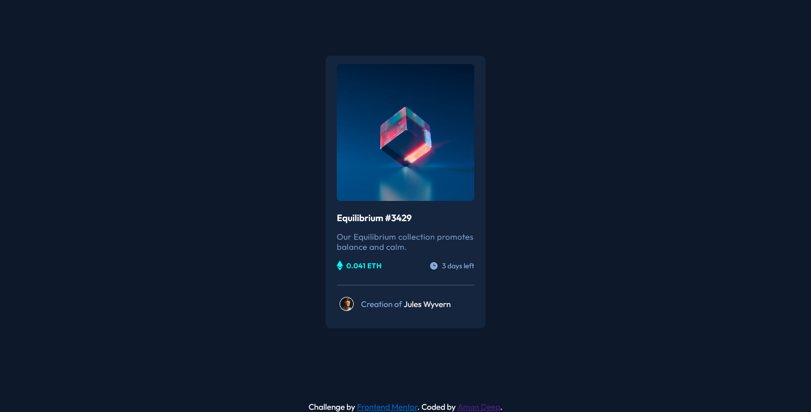

# Frontend Mentor - NFT preview card component solution

This is a solution to the [NFT preview card component challenge on Frontend Mentor](https://www.frontendmentor.io/challenges/nft-preview-card-component-SbdUL_w0U). Frontend Mentor challenges help you improve your coding skills by building realistic projects. 

## Overview

### The challenge

Users should be able to:

- View the optimal layout depending on their device's screen size
- See hover states for interactive elements

### Screenshot

## My process

### Built with

- Semantic HTML5 markup
- CSS custom properties
- Flexbox
- CSS Grid
- Mobile-first workflow

### What I learned

In this challenge , i haven't learnt new stuff but this challenge helps me in brushing up my skill.

### Continued development
From first challenge , i'm more focusing on responsive design . Learning more about grid and flexbox and their implementation.

## Author
- Frontend Mentor - [@amandeep2603](https://www.frontendmentor.io/profile/amandeep2603)
